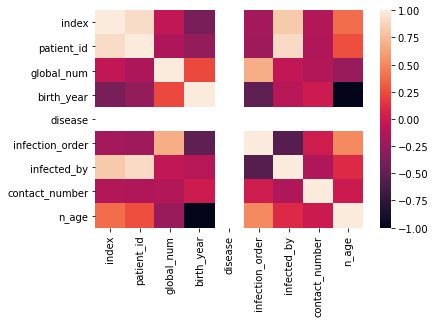
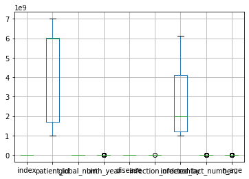

## Random Forest

Random Forest is an ensemble of Decision Trees. With a few exceptions, a `RandomForestClassifier` has all the hyperparameters of a `DecisionTreeClassifier` (to control how trees are grown), plus all the hyperparameters of a `BaggingClassifier` to control the ensemble itself.

The Random Forest algorithm introduces extra randomness when growing trees; instead of searching for the very best feature when splitting a node, it searches for the best feature among a random subset of features. This results in a greater tree diversity, which (once again) trades a higher bias for a lower variance, generally yielding an overall better model. The following `BaggingClassifier` is roughly equivalent to the previous `RandomForestClassifier`. Run the cell below to visualize a single estimator from a random forest model, using the Iris dataset to classify the data into the appropriate species.


```python
#install graphiz
conda install python-graphviz
```


      File "<ipython-input-508-571df625070c>", line 2
        conda install python-graphviz
              ^
    SyntaxError: invalid syntax
    


```python
import graphviz
import subprocess
subprocess.call(['powershell','-command','dir'])
```


```python
from sklearn.datasets import load_iris
iris = load_iris()

# Model (can also use single decision tree)
from sklearn.ensemble import RandomForestClassifier
model = RandomForestClassifier(n_estimators=10)

# Train
model.fit(iris.data, iris.target)
# Extract single tree
estimator = model.estimators_[5]

from sklearn.tree import export_graphviz
# Export as dot file
export_graphviz(estimator, out_file='tree.dot', 
                feature_names = iris.feature_names,
                class_names = iris.target_names,
                rounded = True, proportion = False, 
                precision = 2, filled = True)

# Convert to png using system command (requires Graphviz)
from subprocess import call
call(['dot', '-Tpng', 'tree.dot', '-o', 'tree.png', '-Gdpi=600'])

# Display in jupyter notebook
from IPython.display import Image
Image(filename = 'tree.png')
```

Notice how each split seperates the data into buckets of similar observations. This is a single tree and a relatively simple classification dataset, but the same method is used in a more complex dataset with greater depth to the trees.

## Coronavirus
Coronavirus disease (COVID-19) is an infectious disease caused by a new virus.
The disease causes respiratory illness (like the flu) with symptoms such as a cough, fever, and in more severe cases, difficulty breathing. You can protect yourself by washing your hands frequently, avoiding touching your face, and avoiding close contact (1 meter or 3 feet) with people who are unwell. An outbreak of COVID-19 started in December 2019 and at the time of the creation of this project was continuing to spread throughout the world. Many governments recommended only essential outings to public places and closed most business that do not serve food or sell essential items. An excellent [spatial dashboard](https://www.arcgis.com/apps/opsdashboard/index.html#/bda7594740fd40299423467b48e9ecf6) built by Johns Hopkins shows the daily confirmed cases by country. 

This case study was designed to drive home the important role that data science plays in real-world situations like this pandemic. This case study uses the Random Forest Classifier and a dataset from the South Korean cases of COVID-19 provided on [Kaggle](https://www.kaggle.com/kimjihoo/coronavirusdataset) to encourage research on this important topic. The goal of the case study is to build a Random Forest Classifier to predict the 'state' of the patient.

First, please load the needed packages and modules into Python. Next, load the data into a pandas dataframe for ease of use.


```python
import plotly
plotly.__version__
```


```python
import os
import pandas as pd
from datetime import datetime,timedelta
import seaborn as sns
import matplotlib.pyplot as plt
import numpy as np
%matplotlib inline
import plotly.graph_objects as go
from sklearn.experimental import enable_iterative_imputer
from sklearn.impute import IterativeImputer
from sklearn.ensemble import ExtraTreesRegressor
```


```python
url ='SouthKoreacoronavirusdataset/PatientInfo.csv'
df = pd.read_csv(url)
df.head()
```


<div>
<style scoped>
    .dataframe tbody tr th:only-of-type {
        vertical-align: middle;
    }

    .dataframe tbody tr th {
        vertical-align: top;
    }

    .dataframe thead th {
        text-align: right;
    }
</style>
<table border="1" class="dataframe">
  <thead>
    <tr style="text-align: right;">
      <th></th>
      <th>patient_id</th>
      <th>global_num</th>
      <th>sex</th>
      <th>birth_year</th>
      <th>age</th>
      <th>country</th>
      <th>province</th>
      <th>city</th>
      <th>disease</th>
      <th>infection_case</th>
      <th>infection_order</th>
      <th>infected_by</th>
      <th>contact_number</th>
      <th>symptom_onset_date</th>
      <th>confirmed_date</th>
      <th>released_date</th>
      <th>deceased_date</th>
      <th>state</th>
    </tr>
  </thead>
  <tbody>
    <tr>
      <th>0</th>
      <td>1000000001</td>
      <td>2.0</td>
      <td>male</td>
      <td>1964.0</td>
      <td>50s</td>
      <td>Korea</td>
      <td>Seoul</td>
      <td>Gangseo-gu</td>
      <td>NaN</td>
      <td>overseas inflow</td>
      <td>1.0</td>
      <td>NaN</td>
      <td>75.0</td>
      <td>2020-01-22</td>
      <td>2020-01-23</td>
      <td>2020-02-05</td>
      <td>NaN</td>
      <td>released</td>
    </tr>
    <tr>
      <th>1</th>
      <td>1000000002</td>
      <td>5.0</td>
      <td>male</td>
      <td>1987.0</td>
      <td>30s</td>
      <td>Korea</td>
      <td>Seoul</td>
      <td>Jungnang-gu</td>
      <td>NaN</td>
      <td>overseas inflow</td>
      <td>1.0</td>
      <td>NaN</td>
      <td>31.0</td>
      <td>NaN</td>
      <td>2020-01-30</td>
      <td>2020-03-02</td>
      <td>NaN</td>
      <td>released</td>
    </tr>
    <tr>
      <th>2</th>
      <td>1000000003</td>
      <td>6.0</td>
      <td>male</td>
      <td>1964.0</td>
      <td>50s</td>
      <td>Korea</td>
      <td>Seoul</td>
      <td>Jongno-gu</td>
      <td>NaN</td>
      <td>contact with patient</td>
      <td>2.0</td>
      <td>2.002000e+09</td>
      <td>17.0</td>
      <td>NaN</td>
      <td>2020-01-30</td>
      <td>2020-02-19</td>
      <td>NaN</td>
      <td>released</td>
    </tr>
    <tr>
      <th>3</th>
      <td>1000000004</td>
      <td>7.0</td>
      <td>male</td>
      <td>1991.0</td>
      <td>20s</td>
      <td>Korea</td>
      <td>Seoul</td>
      <td>Mapo-gu</td>
      <td>NaN</td>
      <td>overseas inflow</td>
      <td>1.0</td>
      <td>NaN</td>
      <td>9.0</td>
      <td>2020-01-26</td>
      <td>2020-01-30</td>
      <td>2020-02-15</td>
      <td>NaN</td>
      <td>released</td>
    </tr>
    <tr>
      <th>4</th>
      <td>1000000005</td>
      <td>9.0</td>
      <td>female</td>
      <td>1992.0</td>
      <td>20s</td>
      <td>Korea</td>
      <td>Seoul</td>
      <td>Seongbuk-gu</td>
      <td>NaN</td>
      <td>contact with patient</td>
      <td>2.0</td>
      <td>1.000000e+09</td>
      <td>2.0</td>
      <td>NaN</td>
      <td>2020-01-31</td>
      <td>2020-02-24</td>
      <td>NaN</td>
      <td>released</td>
    </tr>
  </tbody>
</table>
</div>


```python
df.shape
```


    (2218, 18)


```python
#Counts of null values 
na_df=pd.DataFrame(df.isnull().sum().sort_values(ascending=False)).reset_index()
na_df.columns = ['VarName', 'NullCount']
na_df[(na_df['NullCount']>0)]
```


<div>
<style scoped>
    .dataframe tbody tr th:only-of-type {
        vertical-align: middle;
    }

    .dataframe tbody tr th {
        vertical-align: top;
    }

    .dataframe thead th {
        text-align: right;
    }
</style>
<table border="1" class="dataframe">
  <thead>
    <tr style="text-align: right;">
      <th></th>
      <th>VarName</th>
      <th>NullCount</th>
    </tr>
  </thead>
  <tbody>
    <tr>
      <th>0</th>
      <td>disease</td>
      <td>2199</td>
    </tr>
    <tr>
      <th>1</th>
      <td>deceased_date</td>
      <td>2186</td>
    </tr>
    <tr>
      <th>2</th>
      <td>infection_order</td>
      <td>2176</td>
    </tr>
    <tr>
      <th>3</th>
      <td>symptom_onset_date</td>
      <td>2025</td>
    </tr>
    <tr>
      <th>4</th>
      <td>released_date</td>
      <td>1995</td>
    </tr>
    <tr>
      <th>5</th>
      <td>contact_number</td>
      <td>1807</td>
    </tr>
    <tr>
      <th>6</th>
      <td>infected_by</td>
      <td>1749</td>
    </tr>
    <tr>
      <th>7</th>
      <td>infection_case</td>
      <td>1055</td>
    </tr>
    <tr>
      <th>8</th>
      <td>global_num</td>
      <td>904</td>
    </tr>
    <tr>
      <th>9</th>
      <td>birth_year</td>
      <td>454</td>
    </tr>
    <tr>
      <th>10</th>
      <td>age</td>
      <td>261</td>
    </tr>
    <tr>
      <th>11</th>
      <td>sex</td>
      <td>145</td>
    </tr>
    <tr>
      <th>12</th>
      <td>confirmed_date</td>
      <td>141</td>
    </tr>
    <tr>
      <th>13</th>
      <td>state</td>
      <td>88</td>
    </tr>
    <tr>
      <th>14</th>
      <td>city</td>
      <td>65</td>
    </tr>
  </tbody>
</table>
</div>


```python
#counts of response variable values
df.state.value_counts()
```


    isolated    1791
    released     307
    deceased      32
    Name: state, dtype: int64


 **<font color='teal'> Create a new column named 'n_age' which is the calculated age based on the birth year column.</font>**


```python
#remove s's
df['age']=df['age'].str.replace('s','')
```


```python
#pd.to_numeric(df.birth_year)
df['birth_year']= np.nan_to_num(df['birth_year']).astype(int)
df.birth_year.dtypes
```


    dtype('int32')


```python
#create n_age column, and make age column numeric
df= df.assign(n_age=datetime.now().year-df['birth_year'])
df.n_age.dtypes
```


    dtype('int32')


```python
#check by controlling dtytypes
df['age']= np.nan_to_num(df['age'])
```

### Handle Missing Values

 **<font color='teal'> Print the number of missing values by column.</font>**


```python
df.isna().sum()
```


    patient_id               0
    global_num             904
    sex                    145
    birth_year               0
    age                    261
    country                  0
    province                 0
    city                    65
    disease               2199
    infection_case        1055
    infection_order       2176
    infected_by           1749
    contact_number        1807
    symptom_onset_date    2025
    confirmed_date         141
    released_date         1995
    deceased_date         2186
    state                   88
    n_age                    0
    dtype: int64


```python
df.info()
```

    <class 'pandas.core.frame.DataFrame'>
    RangeIndex: 2218 entries, 0 to 2217
    Data columns (total 19 columns):
     #   Column              Non-Null Count  Dtype  
    ---  ------              --------------  -----  
     0   patient_id          2218 non-null   int64  
     1   global_num          1314 non-null   float64
     2   sex                 2073 non-null   object 
     3   birth_year          2218 non-null   int32  
     4   age                 1957 non-null   object 
     5   country             2218 non-null   object 
     6   province            2218 non-null   object 
     7   city                2153 non-null   object 
     8   disease             19 non-null     object 
     9   infection_case      1163 non-null   object 
     10  infection_order     42 non-null     float64
     11  infected_by         469 non-null    float64
     12  contact_number      411 non-null    float64
     13  symptom_onset_date  193 non-null    object 
     14  confirmed_date      2077 non-null   object 
     15  released_date       223 non-null    object 
     16  deceased_date       32 non-null     object 
     17  state               2130 non-null   object 
     18  n_age               2218 non-null   int32  
    dtypes: float64(4), int32(2), int64(1), object(12)
    memory usage: 312.0+ KB
    

 **<font color='teal'> Fill the 'disease' missing values with 0 and remap the True values to 1.</font>**


```python
df[ 'disease'].fillna(0)
df['disease'] = df['disease'].replace(True, 1)
```

 **<font color='teal'> Fill null values in the following columns with their mean: 'global_number','birth_year','infection_order','infected_by'and 'contact_number'</font>**


```python
mean_cols=[ 'global_num','birth_year','infection_order','infected_by', 'contact_number']
df[mean_cols].fillna(value=df[mean_cols].mean(), inplace=False)
```


<div>
<style scoped>
    .dataframe tbody tr th:only-of-type {
        vertical-align: middle;
    }

    .dataframe tbody tr th {
        vertical-align: top;
    }

    .dataframe thead th {
        text-align: right;
    }
</style>
<table border="1" class="dataframe">
  <thead>
    <tr style="text-align: right;">
      <th></th>
      <th>global_num</th>
      <th>birth_year</th>
      <th>infection_order</th>
      <th>infected_by</th>
      <th>contact_number</th>
    </tr>
  </thead>
  <tbody>
    <tr>
      <th>0</th>
      <td>2.000000</td>
      <td>1964</td>
      <td>1.000000</td>
      <td>2.600789e+09</td>
      <td>75.000000</td>
    </tr>
    <tr>
      <th>1</th>
      <td>5.000000</td>
      <td>1987</td>
      <td>1.000000</td>
      <td>2.600789e+09</td>
      <td>31.000000</td>
    </tr>
    <tr>
      <th>2</th>
      <td>6.000000</td>
      <td>1964</td>
      <td>2.000000</td>
      <td>2.002000e+09</td>
      <td>17.000000</td>
    </tr>
    <tr>
      <th>3</th>
      <td>7.000000</td>
      <td>1991</td>
      <td>1.000000</td>
      <td>2.600789e+09</td>
      <td>9.000000</td>
    </tr>
    <tr>
      <th>4</th>
      <td>9.000000</td>
      <td>1992</td>
      <td>2.000000</td>
      <td>1.000000e+09</td>
      <td>2.000000</td>
    </tr>
    <tr>
      <th>...</th>
      <td>...</td>
      <td>...</td>
      <td>...</td>
      <td>...</td>
      <td>...</td>
    </tr>
    <tr>
      <th>2213</th>
      <td>4664.816591</td>
      <td>1990</td>
      <td>2.285714</td>
      <td>2.600789e+09</td>
      <td>24.128954</td>
    </tr>
    <tr>
      <th>2214</th>
      <td>139.000000</td>
      <td>1998</td>
      <td>2.285714</td>
      <td>2.600789e+09</td>
      <td>87.000000</td>
    </tr>
    <tr>
      <th>2215</th>
      <td>222.000000</td>
      <td>1998</td>
      <td>2.285714</td>
      <td>2.600789e+09</td>
      <td>84.000000</td>
    </tr>
    <tr>
      <th>2216</th>
      <td>4345.000000</td>
      <td>1972</td>
      <td>2.285714</td>
      <td>2.600789e+09</td>
      <td>21.000000</td>
    </tr>
    <tr>
      <th>2217</th>
      <td>5534.000000</td>
      <td>1974</td>
      <td>2.285714</td>
      <td>2.600789e+09</td>
      <td>74.000000</td>
    </tr>
  </tbody>
</table>
<p>2218 rows × 5 columns</p>
</div>


 **<font color='teal'> Fill the rest of the missing values with any method.</font>**


```python
df[df.columns[~df.columns.isin(mean_cols)]].sample()
```


<div>
<style scoped>
    .dataframe tbody tr th:only-of-type {
        vertical-align: middle;
    }

    .dataframe tbody tr th {
        vertical-align: top;
    }

    .dataframe thead th {
        text-align: right;
    }
</style>
<table border="1" class="dataframe">
  <thead>
    <tr style="text-align: right;">
      <th></th>
      <th>index</th>
      <th>patient_id</th>
      <th>sex</th>
      <th>age</th>
      <th>country</th>
      <th>province</th>
      <th>city</th>
      <th>disease</th>
      <th>infection_case</th>
      <th>state</th>
      <th>n_age</th>
    </tr>
  </thead>
  <tbody>
    <tr>
      <th>1614</th>
      <td>1614</td>
      <td>6002000005</td>
      <td>female</td>
      <td>40</td>
      <td>Korea</td>
      <td>Gyeongsangbuk-do</td>
      <td>Gyeongju-si</td>
      <td>NaN</td>
      <td>contact with patient</td>
      <td>isolated</td>
      <td>46</td>
    </tr>
  </tbody>
</table>
</div>


```python
#df[fillna_mean] = df[fillna_mean].fillna(df[fillna_mean].mean())
df[df.columns[~df.columns.isin(mean_cols)]].fillna(value=df[df.columns[~df.columns.isin(mean_cols)]].mean())
```


<div>
<style scoped>
    .dataframe tbody tr th:only-of-type {
        vertical-align: middle;
    }

    .dataframe tbody tr th {
        vertical-align: top;
    }

    .dataframe thead th {
        text-align: right;
    }
</style>
<table border="1" class="dataframe">
  <thead>
    <tr style="text-align: right;">
      <th></th>
      <th>index</th>
      <th>patient_id</th>
      <th>sex</th>
      <th>age</th>
      <th>country</th>
      <th>province</th>
      <th>city</th>
      <th>disease</th>
      <th>infection_case</th>
      <th>state</th>
      <th>n_age</th>
    </tr>
  </thead>
  <tbody>
    <tr>
      <th>0</th>
      <td>0</td>
      <td>1000000001</td>
      <td>male</td>
      <td>50</td>
      <td>Korea</td>
      <td>Seoul</td>
      <td>Gangseo-gu</td>
      <td>1.0</td>
      <td>overseas inflow</td>
      <td>released</td>
      <td>57</td>
    </tr>
    <tr>
      <th>1</th>
      <td>1</td>
      <td>1000000002</td>
      <td>male</td>
      <td>30</td>
      <td>Korea</td>
      <td>Seoul</td>
      <td>Jungnang-gu</td>
      <td>1.0</td>
      <td>overseas inflow</td>
      <td>released</td>
      <td>34</td>
    </tr>
    <tr>
      <th>2</th>
      <td>2</td>
      <td>1000000003</td>
      <td>male</td>
      <td>50</td>
      <td>Korea</td>
      <td>Seoul</td>
      <td>Jongno-gu</td>
      <td>1.0</td>
      <td>contact with patient</td>
      <td>released</td>
      <td>57</td>
    </tr>
    <tr>
      <th>3</th>
      <td>3</td>
      <td>1000000004</td>
      <td>male</td>
      <td>20</td>
      <td>Korea</td>
      <td>Seoul</td>
      <td>Mapo-gu</td>
      <td>1.0</td>
      <td>overseas inflow</td>
      <td>released</td>
      <td>30</td>
    </tr>
    <tr>
      <th>4</th>
      <td>4</td>
      <td>1000000005</td>
      <td>female</td>
      <td>20</td>
      <td>Korea</td>
      <td>Seoul</td>
      <td>Seongbuk-gu</td>
      <td>1.0</td>
      <td>contact with patient</td>
      <td>released</td>
      <td>29</td>
    </tr>
    <tr>
      <th>...</th>
      <td>...</td>
      <td>...</td>
      <td>...</td>
      <td>...</td>
      <td>...</td>
      <td>...</td>
      <td>...</td>
      <td>...</td>
      <td>...</td>
      <td>...</td>
      <td>...</td>
    </tr>
    <tr>
      <th>2213</th>
      <td>2213</td>
      <td>6100000085</td>
      <td>male</td>
      <td>30</td>
      <td>Korea</td>
      <td>Gyeongsangnam-do</td>
      <td>Changwon-si</td>
      <td>1.0</td>
      <td>NaN</td>
      <td>NaN</td>
      <td>31</td>
    </tr>
    <tr>
      <th>2214</th>
      <td>2214</td>
      <td>7000000001</td>
      <td>male</td>
      <td>20</td>
      <td>Korea</td>
      <td>Jeju-do</td>
      <td>Jeju-do</td>
      <td>1.0</td>
      <td>etc</td>
      <td>isolated</td>
      <td>23</td>
    </tr>
    <tr>
      <th>2215</th>
      <td>2215</td>
      <td>7000000002</td>
      <td>female</td>
      <td>20</td>
      <td>Korea</td>
      <td>Jeju-do</td>
      <td>Jeju-do</td>
      <td>1.0</td>
      <td>etc</td>
      <td>released</td>
      <td>23</td>
    </tr>
    <tr>
      <th>2216</th>
      <td>2216</td>
      <td>7000000003</td>
      <td>female</td>
      <td>40</td>
      <td>Korea</td>
      <td>Jeju-do</td>
      <td>etc</td>
      <td>1.0</td>
      <td>etc</td>
      <td>released</td>
      <td>49</td>
    </tr>
    <tr>
      <th>2217</th>
      <td>2217</td>
      <td>7000000004</td>
      <td>male</td>
      <td>40</td>
      <td>Korea</td>
      <td>Jeju-do</td>
      <td>Jeju-do</td>
      <td>1.0</td>
      <td>etc</td>
      <td>isolated</td>
      <td>47</td>
    </tr>
  </tbody>
</table>
<p>2218 rows × 11 columns</p>
</div>


 **<font color='teal'> Check for any remaining null values.</font>**


```python
df.isnull().sum()
```


    index                 0
    patient_id            0
    global_num          904
    sex                 145
    birth_year            0
    age                 261
    country               0
    province              0
    city                 65
    disease            2199
    infection_case     1055
    infection_order    2176
    infected_by        1749
    contact_number     1807
    state                88
    n_age                 0
    dtype: int64


```python
df.head()
```


<div>
<style scoped>
    .dataframe tbody tr th:only-of-type {
        vertical-align: middle;
    }

    .dataframe tbody tr th {
        vertical-align: top;
    }

    .dataframe thead th {
        text-align: right;
    }
</style>
<table border="1" class="dataframe">
  <thead>
    <tr style="text-align: right;">
      <th></th>
      <th>index</th>
      <th>patient_id</th>
      <th>global_num</th>
      <th>sex</th>
      <th>birth_year</th>
      <th>age</th>
      <th>country</th>
      <th>province</th>
      <th>city</th>
      <th>disease</th>
      <th>infection_case</th>
      <th>infection_order</th>
      <th>infected_by</th>
      <th>contact_number</th>
      <th>state</th>
      <th>n_age</th>
    </tr>
  </thead>
  <tbody>
    <tr>
      <th>0</th>
      <td>0</td>
      <td>1000000001</td>
      <td>2.0</td>
      <td>male</td>
      <td>1964</td>
      <td>50</td>
      <td>Korea</td>
      <td>Seoul</td>
      <td>Gangseo-gu</td>
      <td>NaN</td>
      <td>overseas inflow</td>
      <td>1.0</td>
      <td>NaN</td>
      <td>75.0</td>
      <td>released</td>
      <td>57</td>
    </tr>
    <tr>
      <th>1</th>
      <td>1</td>
      <td>1000000002</td>
      <td>5.0</td>
      <td>male</td>
      <td>1987</td>
      <td>30</td>
      <td>Korea</td>
      <td>Seoul</td>
      <td>Jungnang-gu</td>
      <td>NaN</td>
      <td>overseas inflow</td>
      <td>1.0</td>
      <td>NaN</td>
      <td>31.0</td>
      <td>released</td>
      <td>34</td>
    </tr>
    <tr>
      <th>2</th>
      <td>2</td>
      <td>1000000003</td>
      <td>6.0</td>
      <td>male</td>
      <td>1964</td>
      <td>50</td>
      <td>Korea</td>
      <td>Seoul</td>
      <td>Jongno-gu</td>
      <td>NaN</td>
      <td>contact with patient</td>
      <td>2.0</td>
      <td>2.002000e+09</td>
      <td>17.0</td>
      <td>released</td>
      <td>57</td>
    </tr>
    <tr>
      <th>3</th>
      <td>3</td>
      <td>1000000004</td>
      <td>7.0</td>
      <td>male</td>
      <td>1991</td>
      <td>20</td>
      <td>Korea</td>
      <td>Seoul</td>
      <td>Mapo-gu</td>
      <td>NaN</td>
      <td>overseas inflow</td>
      <td>1.0</td>
      <td>NaN</td>
      <td>9.0</td>
      <td>released</td>
      <td>30</td>
    </tr>
    <tr>
      <th>4</th>
      <td>4</td>
      <td>1000000005</td>
      <td>9.0</td>
      <td>female</td>
      <td>1992</td>
      <td>20</td>
      <td>Korea</td>
      <td>Seoul</td>
      <td>Seongbuk-gu</td>
      <td>NaN</td>
      <td>contact with patient</td>
      <td>2.0</td>
      <td>1.000000e+09</td>
      <td>2.0</td>
      <td>released</td>
      <td>29</td>
    </tr>
  </tbody>
</table>
</div>


Remove date columns from the data.


```python
df = df.drop(['symptom_onset_date','confirmed_date','released_date','deceased_date'],axis =1)
```


    ---------------------------------------------------------------------------

    KeyError                                  Traceback (most recent call last)

    <ipython-input-604-c24361eee42d> in <module>
    ----> 1 df = df.drop(['symptom_onset_date','confirmed_date','released_date','deceased_date'],axis =1)
    

    C:\Users\toshiba\anaconda3\lib\site-packages\pandas\core\frame.py in drop(self, labels, axis, index, columns, level, inplace, errors)
       4161                 weight  1.0     0.8
       4162         """
    -> 4163         return super().drop(
       4164             labels=labels,
       4165             axis=axis,
    

    C:\Users\toshiba\anaconda3\lib\site-packages\pandas\core\generic.py in drop(self, labels, axis, index, columns, level, inplace, errors)
       3885         for axis, labels in axes.items():
       3886             if labels is not None:
    -> 3887                 obj = obj._drop_axis(labels, axis, level=level, errors=errors)
       3888 
       3889         if inplace:
    

    C:\Users\toshiba\anaconda3\lib\site-packages\pandas\core\generic.py in _drop_axis(self, labels, axis, level, errors)
       3919                 new_axis = axis.drop(labels, level=level, errors=errors)
       3920             else:
    -> 3921                 new_axis = axis.drop(labels, errors=errors)
       3922             result = self.reindex(**{axis_name: new_axis})
       3923 
    

    C:\Users\toshiba\anaconda3\lib\site-packages\pandas\core\indexes\base.py in drop(self, labels, errors)
       5280         if mask.any():
       5281             if errors != "ignore":
    -> 5282                 raise KeyError(f"{labels[mask]} not found in axis")
       5283             indexer = indexer[~mask]
       5284         return self.delete(indexer)
    

    KeyError: "['symptom_onset_date' 'confirmed_date' 'released_date' 'deceased_date'] not found in axis"


Review the count of unique values by column.


```python
print(df.nunique())
```

    index              2218
    patient_id         2218
    global_num         1303
    sex                   2
    birth_year           97
    age                  11
    country               4
    province             17
    city                134
    disease               1
    infection_case       16
    infection_order       6
    infected_by         206
    contact_number       72
    state                 3
    n_age                97
    dtype: int64
    

Review the percent of unique values by column.


```python
print(df.nunique()/df.shape[0]*100)
```

    index              100.000000
    patient_id         100.000000
    global_num          58.746619
    sex                  0.090171
    birth_year           4.373309
    age                  0.495942
    country              0.180343
    province             0.766456
    city                 6.041479
    disease              0.045086
    infection_case       0.721371
    infection_order      0.270514
    infected_by          9.287647
    contact_number       3.246168
    state                0.135257
    n_age                4.373309
    dtype: float64
    

Review the range of values per column.


```python
df.describe().T
```


<div>
<style scoped>
    .dataframe tbody tr th:only-of-type {
        vertical-align: middle;
    }

    .dataframe tbody tr th {
        vertical-align: top;
    }

    .dataframe thead th {
        text-align: right;
    }
</style>
<table border="1" class="dataframe">
  <thead>
    <tr style="text-align: right;">
      <th></th>
      <th>count</th>
      <th>mean</th>
      <th>std</th>
      <th>min</th>
      <th>25%</th>
      <th>50%</th>
      <th>75%</th>
      <th>max</th>
    </tr>
  </thead>
  <tbody>
    <tr>
      <th>index</th>
      <td>2218.0</td>
      <td>1.108500e+03</td>
      <td>6.404258e+02</td>
      <td>0.000000e+00</td>
      <td>5.542500e+02</td>
      <td>1.108500e+03</td>
      <td>1.662750e+03</td>
      <td>2.217000e+03</td>
    </tr>
    <tr>
      <th>patient_id</th>
      <td>2218.0</td>
      <td>4.014678e+09</td>
      <td>2.192419e+09</td>
      <td>1.000000e+09</td>
      <td>1.700000e+09</td>
      <td>6.001000e+09</td>
      <td>6.004000e+09</td>
      <td>7.000000e+09</td>
    </tr>
    <tr>
      <th>global_num</th>
      <td>1314.0</td>
      <td>4.664817e+03</td>
      <td>2.874044e+03</td>
      <td>1.000000e+00</td>
      <td>1.908500e+03</td>
      <td>5.210500e+03</td>
      <td>7.481500e+03</td>
      <td>8.717000e+03</td>
    </tr>
    <tr>
      <th>birth_year</th>
      <td>2218.0</td>
      <td>1.570730e+03</td>
      <td>7.972245e+02</td>
      <td>0.000000e+00</td>
      <td>1.942000e+03</td>
      <td>1.968000e+03</td>
      <td>1.988000e+03</td>
      <td>2.020000e+03</td>
    </tr>
    <tr>
      <th>disease</th>
      <td>19.0</td>
      <td>1.000000e+00</td>
      <td>0.000000e+00</td>
      <td>1.000000e+00</td>
      <td>1.000000e+00</td>
      <td>1.000000e+00</td>
      <td>1.000000e+00</td>
      <td>1.000000e+00</td>
    </tr>
    <tr>
      <th>infection_order</th>
      <td>42.0</td>
      <td>2.285714e+00</td>
      <td>1.254955e+00</td>
      <td>1.000000e+00</td>
      <td>1.250000e+00</td>
      <td>2.000000e+00</td>
      <td>3.000000e+00</td>
      <td>6.000000e+00</td>
    </tr>
    <tr>
      <th>infected_by</th>
      <td>469.0</td>
      <td>2.600789e+09</td>
      <td>1.570638e+09</td>
      <td>1.000000e+09</td>
      <td>1.200000e+09</td>
      <td>2.000000e+09</td>
      <td>4.100000e+09</td>
      <td>6.113000e+09</td>
    </tr>
    <tr>
      <th>contact_number</th>
      <td>411.0</td>
      <td>2.412895e+01</td>
      <td>9.108779e+01</td>
      <td>0.000000e+00</td>
      <td>2.000000e+00</td>
      <td>5.000000e+00</td>
      <td>1.600000e+01</td>
      <td>1.160000e+03</td>
    </tr>
    <tr>
      <th>n_age</th>
      <td>2218.0</td>
      <td>4.502696e+02</td>
      <td>7.972245e+02</td>
      <td>1.000000e+00</td>
      <td>3.300000e+01</td>
      <td>5.300000e+01</td>
      <td>7.900000e+01</td>
      <td>2.021000e+03</td>
    </tr>
  </tbody>
</table>
</div>


### Check for duplicated rows


```python
duplicateRowsDF = df[df.duplicated()]
duplicateRowsDF
```


<div>
<style scoped>
    .dataframe tbody tr th:only-of-type {
        vertical-align: middle;
    }

    .dataframe tbody tr th {
        vertical-align: top;
    }

    .dataframe thead th {
        text-align: right;
    }
</style>
<table border="1" class="dataframe">
  <thead>
    <tr style="text-align: right;">
      <th></th>
      <th>index</th>
      <th>patient_id</th>
      <th>global_num</th>
      <th>sex</th>
      <th>birth_year</th>
      <th>age</th>
      <th>country</th>
      <th>province</th>
      <th>city</th>
      <th>disease</th>
      <th>infection_case</th>
      <th>infection_order</th>
      <th>infected_by</th>
      <th>contact_number</th>
      <th>state</th>
      <th>n_age</th>
    </tr>
  </thead>
  <tbody>
  </tbody>
</table>
</div>


Print the categorical columns and their associated levels.


```python
dfo = df.select_dtypes(include=['object'], exclude=['datetime'])
dfo.shape
#get levels for all variables
vn = pd.DataFrame(dfo.nunique()).reset_index()
vn.columns = ['VarName', 'LevelsCount']
vn.sort_values(by='LevelsCount', ascending =False)
vn
```


<div>
<style scoped>
    .dataframe tbody tr th:only-of-type {
        vertical-align: middle;
    }

    .dataframe tbody tr th {
        vertical-align: top;
    }

    .dataframe thead th {
        text-align: right;
    }
</style>
<table border="1" class="dataframe">
  <thead>
    <tr style="text-align: right;">
      <th></th>
      <th>VarName</th>
      <th>LevelsCount</th>
    </tr>
  </thead>
  <tbody>
    <tr>
      <th>0</th>
      <td>sex</td>
      <td>2</td>
    </tr>
    <tr>
      <th>1</th>
      <td>age</td>
      <td>11</td>
    </tr>
    <tr>
      <th>2</th>
      <td>country</td>
      <td>4</td>
    </tr>
    <tr>
      <th>3</th>
      <td>province</td>
      <td>17</td>
    </tr>
    <tr>
      <th>4</th>
      <td>city</td>
      <td>134</td>
    </tr>
    <tr>
      <th>5</th>
      <td>infection_case</td>
      <td>16</td>
    </tr>
    <tr>
      <th>6</th>
      <td>state</td>
      <td>3</td>
    </tr>
  </tbody>
</table>
</div>


**<font color='teal'> Plot the correlation heat map for the features.</font>**


```python
df.corr()
```


<div>
<style scoped>
    .dataframe tbody tr th:only-of-type {
        vertical-align: middle;
    }

    .dataframe tbody tr th {
        vertical-align: top;
    }

    .dataframe thead th {
        text-align: right;
    }
</style>
<table border="1" class="dataframe">
  <thead>
    <tr style="text-align: right;">
      <th></th>
      <th>index</th>
      <th>patient_id</th>
      <th>global_num</th>
      <th>birth_year</th>
      <th>disease</th>
      <th>infection_order</th>
      <th>infected_by</th>
      <th>contact_number</th>
      <th>n_age</th>
    </tr>
  </thead>
  <tbody>
    <tr>
      <th>index</th>
      <td>1.000000</td>
      <td>0.916691</td>
      <td>-0.050863</td>
      <td>-0.388629</td>
      <td>NaN</td>
      <td>-0.193062</td>
      <td>0.827157</td>
      <td>-0.118342</td>
      <td>0.388629</td>
    </tr>
    <tr>
      <th>patient_id</th>
      <td>0.916691</td>
      <td>1.000000</td>
      <td>-0.144366</td>
      <td>-0.263385</td>
      <td>NaN</td>
      <td>-0.203748</td>
      <td>0.911091</td>
      <td>-0.128676</td>
      <td>0.263385</td>
    </tr>
    <tr>
      <th>global_num</th>
      <td>-0.050863</td>
      <td>-0.144366</td>
      <td>1.000000</td>
      <td>0.234770</td>
      <td>NaN</td>
      <td>0.685239</td>
      <td>-0.050353</td>
      <td>-0.122026</td>
      <td>-0.234770</td>
    </tr>
    <tr>
      <th>birth_year</th>
      <td>-0.388629</td>
      <td>-0.263385</td>
      <td>0.234770</td>
      <td>1.000000</td>
      <td>NaN</td>
      <td>-0.510739</td>
      <td>-0.095998</td>
      <td>0.003278</td>
      <td>-1.000000</td>
    </tr>
    <tr>
      <th>disease</th>
      <td>NaN</td>
      <td>NaN</td>
      <td>NaN</td>
      <td>NaN</td>
      <td>NaN</td>
      <td>NaN</td>
      <td>NaN</td>
      <td>NaN</td>
      <td>NaN</td>
    </tr>
    <tr>
      <th>infection_order</th>
      <td>-0.193062</td>
      <td>-0.203748</td>
      <td>0.685239</td>
      <td>-0.510739</td>
      <td>NaN</td>
      <td>1.000000</td>
      <td>-0.547866</td>
      <td>0.008365</td>
      <td>0.510739</td>
    </tr>
    <tr>
      <th>infected_by</th>
      <td>0.827157</td>
      <td>0.911091</td>
      <td>-0.050353</td>
      <td>-0.095998</td>
      <td>NaN</td>
      <td>-0.547866</td>
      <td>1.000000</td>
      <td>-0.136611</td>
      <td>0.095998</td>
    </tr>
    <tr>
      <th>contact_number</th>
      <td>-0.118342</td>
      <td>-0.128676</td>
      <td>-0.122026</td>
      <td>0.003278</td>
      <td>NaN</td>
      <td>0.008365</td>
      <td>-0.136611</td>
      <td>1.000000</td>
      <td>-0.003278</td>
    </tr>
    <tr>
      <th>n_age</th>
      <td>0.388629</td>
      <td>0.263385</td>
      <td>-0.234770</td>
      <td>-1.000000</td>
      <td>NaN</td>
      <td>0.510739</td>
      <td>0.095998</td>
      <td>-0.003278</td>
      <td>1.000000</td>
    </tr>
  </tbody>
</table>
</div>


```python
sns.heatmap(df.corr(),annot_kws={"size": 35 / np.sqrt(len(df.corr()))})
```


    <AxesSubplot:>


    

    


**<font color='teal'> Plot the boxplots to check for outliers. </font>**


```python
df.boxplot()
```


    <AxesSubplot:>


    

    


**<font color='teal'> Create dummy features for object type features. </font>**


```python
#for -object types- i dont know if i can create dummy vatiables. the best i can do is this:
pd.get_dummies(df)
```


<div>
<style scoped>
    .dataframe tbody tr th:only-of-type {
        vertical-align: middle;
    }

    .dataframe tbody tr th {
        vertical-align: top;
    }

    .dataframe thead th {
        text-align: right;
    }
</style>
<table border="1" class="dataframe">
  <thead>
    <tr style="text-align: right;">
      <th></th>
      <th>index</th>
      <th>patient_id</th>
      <th>global_num</th>
      <th>birth_year</th>
      <th>disease</th>
      <th>infection_order</th>
      <th>infected_by</th>
      <th>contact_number</th>
      <th>n_age</th>
      <th>sex_female</th>
      <th>...</th>
      <th>infection_case_Shincheonji Church</th>
      <th>infection_case_Suyeong-gu Kindergarten</th>
      <th>infection_case_contact with patient</th>
      <th>infection_case_etc</th>
      <th>infection_case_gym facility in Cheonan</th>
      <th>infection_case_gym facility in Sejong</th>
      <th>infection_case_overseas inflow</th>
      <th>state_deceased</th>
      <th>state_isolated</th>
      <th>state_released</th>
    </tr>
  </thead>
  <tbody>
    <tr>
      <th>0</th>
      <td>0</td>
      <td>1000000001</td>
      <td>2.0</td>
      <td>1964</td>
      <td>NaN</td>
      <td>1.0</td>
      <td>NaN</td>
      <td>75.0</td>
      <td>57</td>
      <td>0</td>
      <td>...</td>
      <td>0</td>
      <td>0</td>
      <td>0</td>
      <td>0</td>
      <td>0</td>
      <td>0</td>
      <td>1</td>
      <td>0</td>
      <td>0</td>
      <td>1</td>
    </tr>
    <tr>
      <th>1</th>
      <td>1</td>
      <td>1000000002</td>
      <td>5.0</td>
      <td>1987</td>
      <td>NaN</td>
      <td>1.0</td>
      <td>NaN</td>
      <td>31.0</td>
      <td>34</td>
      <td>0</td>
      <td>...</td>
      <td>0</td>
      <td>0</td>
      <td>0</td>
      <td>0</td>
      <td>0</td>
      <td>0</td>
      <td>1</td>
      <td>0</td>
      <td>0</td>
      <td>1</td>
    </tr>
    <tr>
      <th>2</th>
      <td>2</td>
      <td>1000000003</td>
      <td>6.0</td>
      <td>1964</td>
      <td>NaN</td>
      <td>2.0</td>
      <td>2.002000e+09</td>
      <td>17.0</td>
      <td>57</td>
      <td>0</td>
      <td>...</td>
      <td>0</td>
      <td>0</td>
      <td>1</td>
      <td>0</td>
      <td>0</td>
      <td>0</td>
      <td>0</td>
      <td>0</td>
      <td>0</td>
      <td>1</td>
    </tr>
    <tr>
      <th>3</th>
      <td>3</td>
      <td>1000000004</td>
      <td>7.0</td>
      <td>1991</td>
      <td>NaN</td>
      <td>1.0</td>
      <td>NaN</td>
      <td>9.0</td>
      <td>30</td>
      <td>0</td>
      <td>...</td>
      <td>0</td>
      <td>0</td>
      <td>0</td>
      <td>0</td>
      <td>0</td>
      <td>0</td>
      <td>1</td>
      <td>0</td>
      <td>0</td>
      <td>1</td>
    </tr>
    <tr>
      <th>4</th>
      <td>4</td>
      <td>1000000005</td>
      <td>9.0</td>
      <td>1992</td>
      <td>NaN</td>
      <td>2.0</td>
      <td>1.000000e+09</td>
      <td>2.0</td>
      <td>29</td>
      <td>1</td>
      <td>...</td>
      <td>0</td>
      <td>0</td>
      <td>1</td>
      <td>0</td>
      <td>0</td>
      <td>0</td>
      <td>0</td>
      <td>0</td>
      <td>0</td>
      <td>1</td>
    </tr>
    <tr>
      <th>...</th>
      <td>...</td>
      <td>...</td>
      <td>...</td>
      <td>...</td>
      <td>...</td>
      <td>...</td>
      <td>...</td>
      <td>...</td>
      <td>...</td>
      <td>...</td>
      <td>...</td>
      <td>...</td>
      <td>...</td>
      <td>...</td>
      <td>...</td>
      <td>...</td>
      <td>...</td>
      <td>...</td>
      <td>...</td>
      <td>...</td>
      <td>...</td>
    </tr>
    <tr>
      <th>2213</th>
      <td>2213</td>
      <td>6100000085</td>
      <td>NaN</td>
      <td>1990</td>
      <td>NaN</td>
      <td>NaN</td>
      <td>NaN</td>
      <td>NaN</td>
      <td>31</td>
      <td>0</td>
      <td>...</td>
      <td>0</td>
      <td>0</td>
      <td>0</td>
      <td>0</td>
      <td>0</td>
      <td>0</td>
      <td>0</td>
      <td>0</td>
      <td>0</td>
      <td>0</td>
    </tr>
    <tr>
      <th>2214</th>
      <td>2214</td>
      <td>7000000001</td>
      <td>139.0</td>
      <td>1998</td>
      <td>NaN</td>
      <td>NaN</td>
      <td>NaN</td>
      <td>87.0</td>
      <td>23</td>
      <td>0</td>
      <td>...</td>
      <td>0</td>
      <td>0</td>
      <td>0</td>
      <td>1</td>
      <td>0</td>
      <td>0</td>
      <td>0</td>
      <td>0</td>
      <td>1</td>
      <td>0</td>
    </tr>
    <tr>
      <th>2215</th>
      <td>2215</td>
      <td>7000000002</td>
      <td>222.0</td>
      <td>1998</td>
      <td>NaN</td>
      <td>NaN</td>
      <td>NaN</td>
      <td>84.0</td>
      <td>23</td>
      <td>1</td>
      <td>...</td>
      <td>0</td>
      <td>0</td>
      <td>0</td>
      <td>1</td>
      <td>0</td>
      <td>0</td>
      <td>0</td>
      <td>0</td>
      <td>0</td>
      <td>1</td>
    </tr>
    <tr>
      <th>2216</th>
      <td>2216</td>
      <td>7000000003</td>
      <td>4345.0</td>
      <td>1972</td>
      <td>NaN</td>
      <td>NaN</td>
      <td>NaN</td>
      <td>21.0</td>
      <td>49</td>
      <td>1</td>
      <td>...</td>
      <td>0</td>
      <td>0</td>
      <td>0</td>
      <td>1</td>
      <td>0</td>
      <td>0</td>
      <td>0</td>
      <td>0</td>
      <td>0</td>
      <td>1</td>
    </tr>
    <tr>
      <th>2217</th>
      <td>2217</td>
      <td>7000000004</td>
      <td>5534.0</td>
      <td>1974</td>
      <td>NaN</td>
      <td>NaN</td>
      <td>NaN</td>
      <td>74.0</td>
      <td>47</td>
      <td>0</td>
      <td>...</td>
      <td>0</td>
      <td>0</td>
      <td>0</td>
      <td>1</td>
      <td>0</td>
      <td>0</td>
      <td>0</td>
      <td>0</td>
      <td>1</td>
      <td>0</td>
    </tr>
  </tbody>
</table>
<p>2218 rows × 196 columns</p>
</div>


### Split the data into test and train subsamples


```python
from sklearn.model_selection import train_test_split

# dont forget to define your X and y
X=pd.get_dummies(df)#df.infected_by
y=df.birth_year
X_train, X_test, y_train, y_test = train_test_split(X, y, test_size=.2, random_state=1)
```

### Scale data to prep for model creation


```python
#scale data
from sklearn import preprocessing
import numpy as np
# build scaler based on training data and apply it to test data to then also scale the test data
scaler = preprocessing.StandardScaler().fit(X_train)
X_train_scaled=scaler.transform(X_train)
X_test_scaled=scaler.transform(X_test)

```


```python
from sklearn.metrics import precision_recall_curve
from sklearn.metrics import f1_score
from sklearn.metrics import auc
from sklearn.linear_model import LogisticRegression
from matplotlib import pyplot
from sklearn.metrics import precision_recall_curve
from sklearn.metrics import f1_score
from sklearn.metrics import auc
from sklearn.linear_model import LogisticRegression
from sklearn.metrics import classification_report,confusion_matrix,roc_curve,roc_auc_score
from sklearn.metrics import accuracy_score,log_loss
from matplotlib import pyplot
```

### Fit Random Forest Classifier
The fit model shows an overall accuracy of 80% which is great and indicates our model was effectively able to identify the status of a patients in the South Korea dataset.


```python
#df.replace([np.inf, -np.inf], np.nan, inplace=True)
y_train = np.nan_to_num(y_train)
X_train_scaled = np.nan_to_num(X_train_scaled)
X_test_scaled = np.nan_to_num(X_test_scaled)
```


```python
from sklearn.ensemble import RandomForestClassifier
clf = RandomForestClassifier(n_estimators=300, random_state = 1,n_jobs=-1)
model_res = clf.fit(X_train_scaled, y_train)
y_pred = model_res.predict(X_test_scaled)
y_pred = np.nan_to_num(y_pred)
y_pred_prob = model_res.predict_proba(X_test_scaled)
lr_probs = y_pred_prob[:,1]
ac = accuracy_score(y_test, y_pred)

f1 = f1_score(y_test, y_pred, average='weighted')
cm = confusion_matrix(y_test, y_pred)

print('Random Forest: Accuracy=%.3f' % (ac))

print('Random Forest: f1-score=%.3f' % (f1))
```

    Random Forest: Accuracy=0.615
    Random Forest: f1-score=0.606
    

### Create Confusion Matrix Plots
Confusion matrices are great ways to review your model performance for a multi-class classification problem. Being able to identify which class the misclassified observations end up in is a great way to determine if you need to build additional features to improve your overall model. In the example below we plot a regular counts confusion matrix as well as a weighted percent confusion matrix. The percent confusion matrix is particulary helpful when you have unbalanced class sizes.


```python
class_names=['isolated','released','missing','deceased'] # name  of classes
```


```python
import itertools
import numpy as np
import matplotlib.pyplot as plt

from sklearn import svm, datasets
from sklearn.model_selection import train_test_split
from sklearn.metrics import confusion_matrix

def plot_confusion_matrix(cm, classes,
                          normalize=False,
                          title='Confusion matrix',
                          cmap=plt.cm.Blues):
    """
    This function prints and plots the confusion matrix.
    Normalization can be applied by setting `normalize=True`.
    """
    if normalize:
        cm = cm.astype('float') / cm.sum(axis=1)[:, np.newaxis]
        print("Normalized confusion matrix")
    else:
        print('Confusion matrix, without normalization')

    print(cm)

    plt.imshow(cm, interpolation='nearest', cmap=cmap)
    plt.title(title)
    plt.colorbar()
    tick_marks = np.arange(len(classes))
    plt.xticks(tick_marks, classes, rotation=45)
    plt.yticks(tick_marks, classes)

    fmt = '.2f' if normalize else 'd'
    thresh = cm.max() / 2.
    for i, j in itertools.product(range(cm.shape[0]), range(cm.shape[1])):
        plt.text(j, i, format(cm[i, j], fmt),
                 horizontalalignment="center",
                 color="white" if cm[i, j] > thresh else "black")

    plt.ylabel('True label')
    plt.xlabel('Predicted label')
    plt.tight_layout()


# Compute confusion matrix
cnf_matrix = confusion_matrix(y_test, y_pred)
np.set_printoptions(precision=2)

# Plot non-normalized confusion matrix
plt.figure()
plot_confusion_matrix(cnf_matrix, classes=class_names,
                      title='Confusion matrix, without normalization')
#plt.savefig('figures/RF_cm_multi_class.png')

# Plot normalized confusion matrix
plt.figure()
plot_confusion_matrix(cnf_matrix, classes=class_names, normalize=True,
                      title='Normalized confusion matrix')
#plt.savefig('figures/RF_cm_proportion_multi_class.png', bbox_inches="tight")
plt.show()
```


    ---------------------------------------------------------------------------

    NameError                                 Traceback (most recent call last)

    <ipython-input-588-22d4a1ec7842> in <module>
         43 
         44 # Compute confusion matrix
    ---> 45 cnf_matrix = confusion_matrix(y_test, y_pred)
         46 np.set_printoptions(precision=2)
         47 
    

    NameError: name 'y_pred' is not defined


### Plot feature importances
The random forest algorithm can be used as a regression or classification model. In either case it tends to be a bit of a black box, where understanding what's happening under the hood can be difficult. Plotting the feature importances is one way that you can gain a perspective on which features are driving the model predictions.


```python
feature_importance = clf.feature_importances_
# make importances relative to max importance
feature_importance = 100.0 * (feature_importance / feature_importance.max())[:30]
sorted_idx = np.argsort(feature_importance)[:30]

pos = np.arange(sorted_idx.shape[0]) + .5
print(pos.size)
sorted_idx.size
plt.figure(figsize=(10,10))
plt.barh(pos, feature_importance[sorted_idx], align='center')
plt.yticks(pos, X.columns[sorted_idx])
plt.xlabel('Relative Importance')
plt.title('Variable Importance')
plt.show()
```

The popularity of random forest is primarily due to how well it performs in a multitude of data situations. It tends to handle highly correlated features well, where as a linear regression model would not. In this case study we demonstrate the performance ability even with only a few features and almost all of them being highly correlated with each other.
Random Forest is also used as an efficient way to investigate the importance of a set of features with a large data set. Consider random forest to be one of your first choices when building a decision tree, especially for multiclass classifications.
